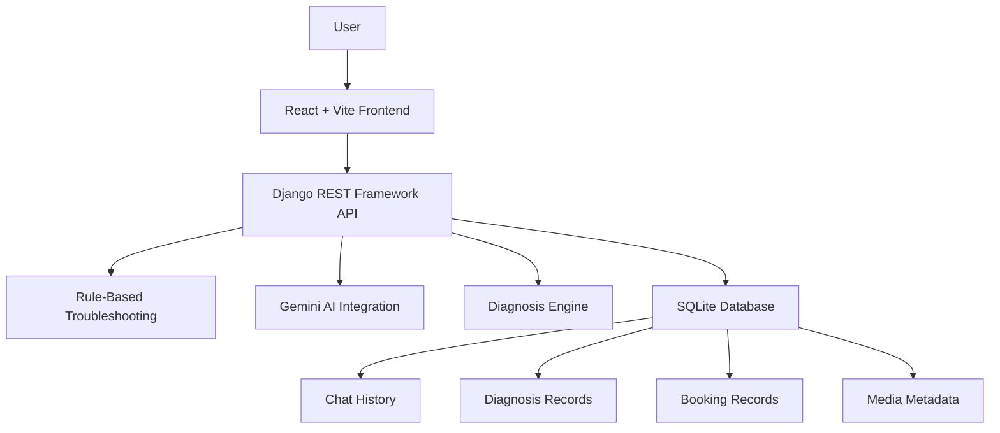

# AutoCare AI — Your Intelligent Car Mechanic

An AI-powered car mechanic chatbot that helps users understand vehicle problems, troubleshoot common issues, explore possible diagnoses, and book mechanic appointments — all through a conversational interface.

AutoCare AI combines rule-based troubleshooting with Gemini-powered AI to make vehicle assistance more accessible, interactive, and easy to use.

> **Understand the problem. Explore the solution. Get back on the road.**

---

## Overview

AutoCare AI is a full-stack web application designed to simplify the first step of car troubleshooting.

Instead of searching through scattered forums or struggling to describe a vehicle issue, users can interact with an AI mechanic, explain their symptoms, and receive relevant troubleshooting guidance.

The platform also supports media uploads, diagnosis workflows, and mechanic appointment bookings — bringing multiple vehicle assistance features into one application.

## Features

### AI-Powered Mechanic Chat

* Conversational car troubleshooting assistant.
* Gemini-powered responses for complex or open-ended queries.
* Rule-based responses for common vehicle issues.
* Context-aware conversations for more relevant assistance.
* Fallback handling when AI responses are unavailable.

### Vehicle Diagnosis

* Submit vehicle symptoms for troubleshooting.
* Receive possible causes and diagnostic guidance.
* Use structured diagnosis workflows for common car problems.

### Media Uploads

* Upload relevant media to support a troubleshooting conversation.
* Associate uploaded media with chat requests.
* Extend the conversation with additional context about the vehicle issue.

### Mechanic Appointment Booking

* Submit mechanic appointment requests.
* View booking details using a booking ID.
* Retrieve booking records.
* Update booking status through the API.

### Full-Stack Experience

* React-based interactive frontend.
* Django REST Framework backend.
* SQLite database for application data.
* Chat history and booking workflows.
* Environment-based frontend API configuration.

---

## Tech Stack

| Layer             | Technologies                          |
| ----------------- | ------------------------------------- |
| Frontend          | React, Vite, JavaScript               |
| Backend           | Python, Django, Django REST Framework |
| Database          | SQLite                                |
| AI Integration    | Google Gemini API                     |
| API Communication | REST API                              |
| Development Tools | Git, GitHub, VS Code                  |

---

## Architecture



The React frontend communicates with the Django REST API. The backend handles chat requests, troubleshooting logic, diagnosis workflows, media uploads, and appointment records.

Gemini is used for AI-assisted responses, while rule-based logic supports common troubleshooting scenarios and fallback behavior.

---

## Project Structure

```text
autocare-ai-mechanic/
│
├── backend/
│   ├── manage.py
│   ├── requirements.txt
│   ├── ...
│
├── frontend/
│   ├── src/
│   ├── public/
│   ├── package.json
│   ├── vite.config.js
│   └── ...
│
├── .gitignore
└── README.md
```

*The backend and frontend directories may contain additional application-specific files and modules.*

---

## Getting Started

Follow these steps to run AutoCare AI locally.

### Prerequisites

Make sure you have the following installed:

* Python
* Node.js and npm
* Git

### 1. Clone the Repository

```bash
git clone https://github.com/onlyshreeya/autocare-ai-mechanic.git
cd autocare-ai-mechanic
```

### 2. Set Up the Backend

Navigate to the backend directory:

```bash
cd backend
```

Create and activate a virtual environment.

**Windows:**

```bash
python -m venv .venv
.venv\Scripts\activate
```

Install the required dependencies:

```bash
pip install -r requirements.txt
```

### 3. Configure Environment Variables

Create a `.env` file in the backend directory and add your Gemini API key:

```env
GEMINI_API_KEY=your_gemini_api_key
```

Replace the placeholder with your own API key.

Keep your API key private. Do not commit `.env` files or expose API keys in frontend code.

### 4. Run Database Migrations

```bash
python manage.py migrate
```

### 5. Start the Backend Server

```bash
python manage.py runserver
```

The Django development server will be available at:

```text
http://127.0.0.1:8000/
```

Keep this terminal running.

### 6. Set Up the Frontend

Open a new terminal and navigate to the frontend directory:

```bash
cd frontend
```

Install dependencies:

```bash
npm install
```

If your frontend uses an API base URL environment variable, configure it in the frontend's `.env` file:

```env
VITE_API_BASE_URL=http://127.0.0.1:8000
```

Start the development server:

```bash
npm run dev
```

Open the local URL displayed by Vite in your terminal.

---

## API Reference

The backend exposes REST endpoints for chat, diagnosis, media uploads, and mechanic bookings.

| Method    | Endpoint                     | Description                      |
| --------- | ---------------------------- | -------------------------------- |
| GET, POST | `/api/chat/`                 | Retrieve or send chat messages   |
| POST      | `/api/chat/upload/`          | Upload media for troubleshooting |
| POST      | `/api/diagnosis/`            | Submit a diagnosis request       |
| GET       | `/api/diagnosis/`            | Retrieve diagnosis records       |
| POST      | `/api/booking/`              | Create a mechanic booking        |
| GET       | `/api/booking/<id>/`         | Retrieve a booking by ID         |
| GET       | `/api/bookings/`             | Retrieve booking records         |
| PATCH     | `/api/bookings/<id>/status/` | Update booking status            |

The backend may also expose an upload alias at `/api/upload/`.

**Note:** Request payloads, response structures, validation rules, and supported status values depend on the backend implementation.

---

## Configuration & Security

AutoCare AI uses environment variables for sensitive configuration.

* Keep API keys out of source control.
* Store secrets in environment variables.
* Configure the frontend API URL for the environment where the backend is deployed.
* Do not use Django development settings as production settings.
* Configure allowed hosts, CORS, and debug settings appropriately before deployment.

Never expose your Gemini API key through client-side React code.

---

## Current Scope & Limitations

AutoCare AI is an AI-assisted troubleshooting application, not a replacement for a qualified mechanic.

* Diagnosis results are possible explanations, not guaranteed vehicle diagnoses.
* AI responses may occasionally be inaccurate or unavailable.
* Rule-based troubleshooting covers defined scenarios and may not handle every vehicle issue.
* Physical inspection may be required to identify or repair a vehicle problem.

For safety-critical vehicle issues, users should consult a qualified mechanic.

---

## Future Improvements

Potential areas for further development:

* More comprehensive vehicle troubleshooting coverage.
* Improved multimodal diagnosis workflows.
* Enhanced booking management and appointment tracking.
* Authentication and personalized user profiles.
* Expanded testing and production monitoring.
* Deployment with production-ready security and configuration.

---

## Running Tests

### Backend

From the backend directory:

```bash
python manage.py test
```

### Frontend

From the frontend directory:

```bash
npm run build
```

These commands can be used to run Django tests and verify that the frontend builds successfully.

---

## Deployment

The application is designed as a separate frontend and backend, allowing each part to be deployed independently.

* **Frontend:** Vercel
* **Backend:** AWS or another Python-compatible hosting platform
* **Database:** SQLite for local development; evaluate a production database based on deployment requirements.

Deployment requires production environment variables, a reachable backend API, and appropriate CORS and security configuration.

---

## Author

**Shreeya Srivastava**

B.Tech — Computer Science & Engineering (AI & ML)

GitHub: [@onlyshreeya](https://github.com/onlyshreeya)

---

## A Note

AutoCare AI is a project exploring how AI and full-stack development can come together to create practical, conversational vehicle assistance.

Built with curiosity, code, and a drive to make troubleshooting a little easier.
