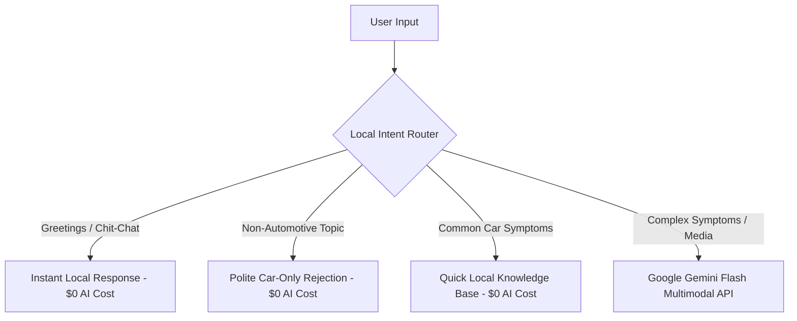

# 🚗 AI Car Mechanic Chatbot

An intelligent full-stack application that acts as a virtual Senior Automobile Technician to help vehicle owners troubleshoot issues, analyze uploaded media, receive instant diagnoses, and book mechanic appointments.

Built for the **Full-Stack Developer Intern 48-Hour Task**.

---

## ✨ Features at a Glance

- 💬 **Conversational AI Mechanic**: Short, natural 1-on-1 dialogue with a Senior Master Automobile Technician persona.
- 🎯 **Car-Only Focus**: Strictly filters out non-automotive queries (e.g. coding, recipes, weather).
- 📸 **Multimodal Media Analysis**: Upload vehicle photos, videos, or audio recordings for visual & auditory issue analysis.
- ⚡ **Automated Vehicle Diagnosis**: Instant symptom breakdown with severity ratings (Low, Medium, High).
- 📅 **Mechanic Appointment Booking**: Complete booking workflow with date/time slot validation and confirmation modals.
- 🎨 **Modern Dark Glassmorphism UI**: Right-aligned user bubbles (subtle green accent) and left-aligned AI bubbles (dark neutral).

---

## 📐 Architecture & AI Cost Minimization

To minimize external API usage and maximize response speed, the backend implements a **Hybrid Intent & Routing Engine**:



1. **Local Intent Router**: Intercepts greetings and casual chat without calling the Gemini API.
2. **Domain Guard**: Filters non-car questions locally to save API quota.
3. **Gemini Flash AI**: Invoked only for complex vehicle troubleshooting, multi-turn follow-ups, or media analysis.

---

## 🛠️ Technology Stack

- **Frontend**: React 18, Vite, Lucide React Icons, Vanilla CSS
- **Backend**: Python 3.13, Django 6.1, Django REST Framework (DRF)
- **Database**: SQLite
- **AI Engine**: Google GenAI SDK (`google-genai`), Gemini 3.6 / 3.7 Flash API

---

## 📡 REST API Reference

All required REST API endpoints are fully implemented and validated:

| Method | Endpoint | Description |
| :--- | :--- | :--- |
| **`POST`** | `/api/chat/` | Send message to AI Mechanic assistant with history context & media ID |
| **`GET`** | `/api/chat/` | Retrieve saved chat conversation history |
| **`POST`** | `/api/upload/` | Upload vehicle images, videos, or audio files (up to 20MB) |
| **`POST`** | `/api/diagnosis/` | Generate vehicle symptom diagnosis and severity level |
| **`GET`** | `/api/diagnosis/` | Retrieve past vehicle diagnosis records |
| **`POST`** | `/api/booking/` | Create a new mechanic appointment booking |
| **`GET`** | `/api/booking/{id}/` | Retrieve specific booking details by ID |
| **`GET`** | `/api/bookings/` | List all mechanic bookings |

---

## 🚀 Quick Start Guide

### 1. Backend Setup (Django)
```bash
# 1. Clone repository
git clone <your-repository-url>
cd "AI Car Mechanic Chatbot"

# 2. Create & activate virtual environment
python -m venv .venv
# Windows: .venv\Scripts\activate
# Linux/macOS: source .venv/bin/activate

# 3. Install dependencies
pip install django djangorestframework django-cors-headers python-dotenv google-genai

# 4. Configure environment variables
echo GEMINI_API_KEY="your_gemini_api_key_here" > .env

# 5. Run database migrations & start server
python manage.py migrate
python manage.py runserver 8000
```
Backend will run at `http://127.0.0.1:8000`.

### 2. Frontend Setup (React / Vite)
```bash
# 1. Navigate to frontend folder
cd frontend

# 2. Install packages & start server
npm install
npm run dev
```
Frontend will run at `http://localhost:5173`.

---

## ☁️ Deployment Instructions

- **Frontend (Vercel)**: Import repository into Vercel, set root directory to `frontend`, add `VITE_API_BASE_URL="https://your-backend-api.com"`, and deploy.
- **Backend (AWS Free Tier / Render / EC2)**: Deploy Django project with Gunicorn (`gunicorn config.wsgi:application --bind 0.0.0.0:8000`) and set `GEMINI_API_KEY` in environment variables.

---

## 📄 Evaluation Criteria Compliance

Built for the **Full-Stack Developer Intern 48-Hour Task**. Designed with high code quality, clean API architecture, responsive dark UI, error handling, and optimal AI usage minimization.
